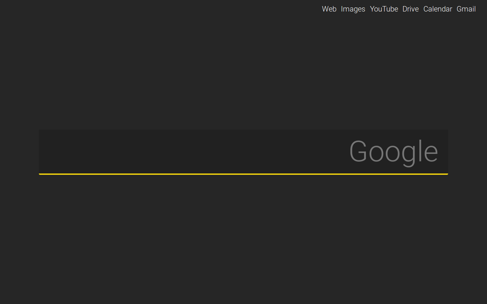

# GooglePage

I wanted a different looking homepage but keep the functionality of google.com.

To tackle that, I created [GooglePage](https://shreydan.github.io/GooglePage)

It certainly looks better, is responsive and is quite useful.

The website also integrates Google Images search and YouTube search.

Click on the menu on the top right to switch modes:
    
    - Web : Google Search mode
    - Images : Google Images Search mode
    - YouTube : YouTube Search mode
    
Redirects to useful Google sites:

    - Maps
    - Drive
    - Calendar
    - Gmail
    
It looks like this:

